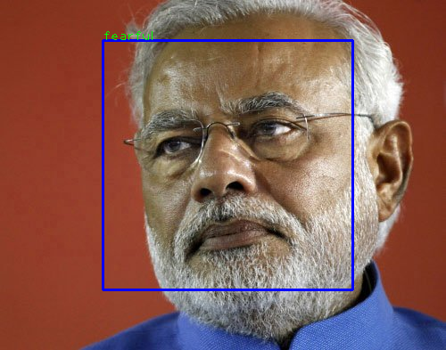
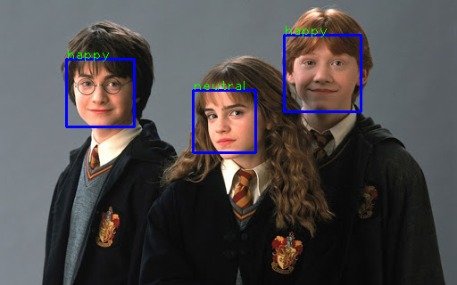

# Face_emotion_recognition
  We explore human recognition system to identify 7 types of emotions by using FER2013 dataset.
  Further we build neural network and train our model using fer2013 dataset. Finally, we evaluate 
  the accuracy and predict facial emotions by giving pics as inputs and also by camera. 
# Overview

# Dependencies
 - Python == 3.6
 - opencv == 4.1.2
 - Keras
 - numpy
 - tensorflow with gpu support (pip install tensorflow-gpu)
 - tflearn (pip install tflearn)
# Dataset
  [fer2013](https://www.kaggle.com/c/challenges-in-representation-learning-facial-expression-recognition-challenge/data)
  
  
 

 

